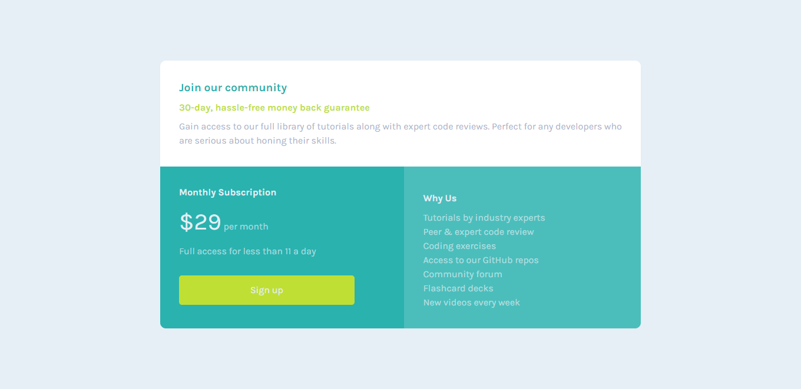

# Frontend Mentor - Single price grid component solution

This is a solution to the [Single price grid component challenge on Frontend Mentor](https://www.frontendmentor.io/challenges/single-price-grid-component-5ce41129d0ff452fec5abbbc). Frontend Mentor challenges help you improve your coding skills by building realistic projects. 

## Table of contents

- [Overview](#overview)
  - [The challenge](#the-challenge)
  - [Screenshot](#screenshot)
  - [Links](#links)
- [My process](#my-process)
  - [Built with](#built-with)
  - [What I learned](#what-i-learned)
  - [Useful resources](#useful-resources)
- [Author](#author)

## Overview

### The challenge

Users should be able to:

- View the optimal layout for the component depending on their device's screen size
- See a hover state on desktop for the Sign Up call-to-action

### Screenshot

### Links

- Solution URL: (https://github.com/luciaguerra/single-price-grid-component)
- Live Site URL: (https://single-price-grid-component01.netlify.app/)

## My process
This was something easy but challenging enough to keep practicing CSS Grid. It's the first time I finish a project using Grid and I'm very proud of it!

To get to the final result I had to get through a lot of posibilities, a lot of lenght units until I got the right size for each Grid to not break the design.

Speaking about the responsive design, it was so easy! I'm not sure if there's an easier way to do it using Grid and that's something that took me a while to realise. But I have to keep learning about Grid to answer all of my doubts.

### Built with

- Semantic HTML5 markup
- CSS custom properties
- Flexbox
- CSS Grid

### What I learned
This really helped me to get a little more confident about Grid! It gave me place to experiment and play to get the expected result! Nevertheless, I need to keep practicing for me to master Grid.

### Useful resources

- [Grid Template](https://www.w3schools.com/css/tryit.asp?filename=trycss_template1_grid) - This was very useful to have as reference when creating the responsive design. I wasn't sure about how to turn the design into a single column but it was easier than I thought!

## Author

- Frontend Mentor - [@luciaguerra](https://www.frontendmentor.io/profile/luciaguerra)
- Twitter - [@lucihtml](https://www.twitter.com/lucihtml)

